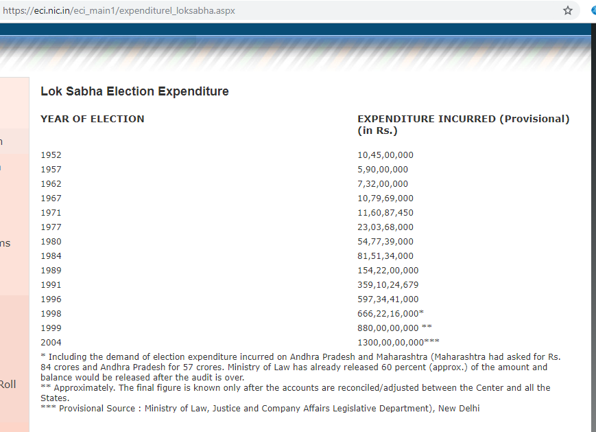
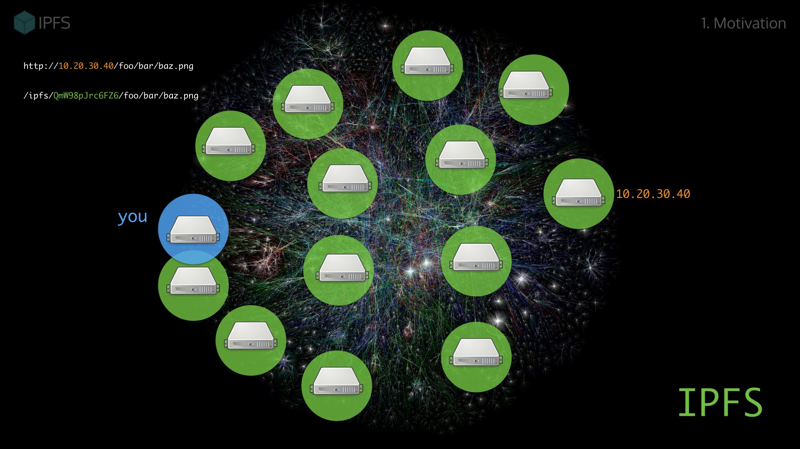

# Dvoting
Electronic voting (e-voting), which uses electronic systems to aid
casting and counting votes in an election, has been a research
topic of interest for the past few decades in cryptography.
Remote-voting can be viewed as special case of secure multi-party
computation . Develop a secure, transparent and decentralized
application for remote voting system as a medium for voting for
various purposes including views on different issues or political
voting

### Advantanges of blockchain in E-Voting:

- Tamper proof
- Decentralised(No central point of failure)
- Transparent
- Paper Less
### HyperLedger Vs Etherium:
- Gas
- Inefficient
- HyperLedger 50,0000 TPM(Transaction Per Minute), Ehterium 1000TPM
- 51% Attack
### Architecture

### Using Interplanetary File system(IPFS) to host
|                      | Web 2.0 | Web 3.0(dApps) |
| -------------------- |:----------:| -----:|
| Scalable Computation | AWS | Hyperledger  |
| File Storage | Amazon S3 | IPFS |
| Monetization | Ads, Selling Goods | Token Model |
| Payments | Credit Cards,Paypal| Etherium, Bitcoin, ERC20Tokens|

